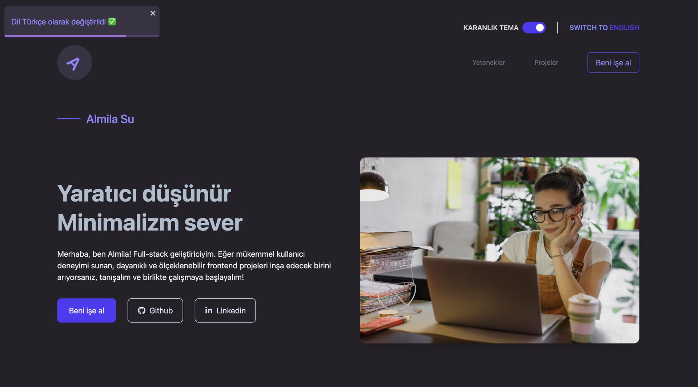
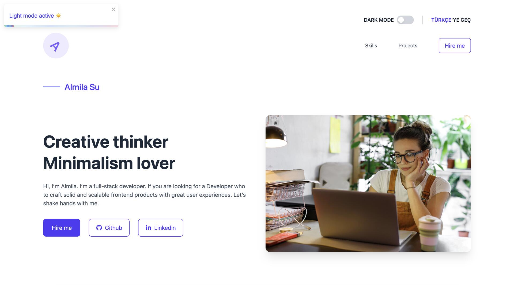
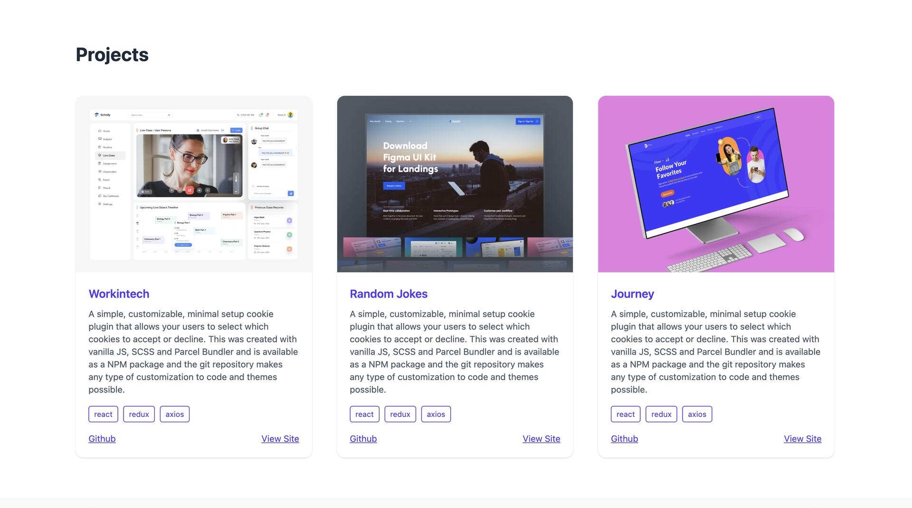
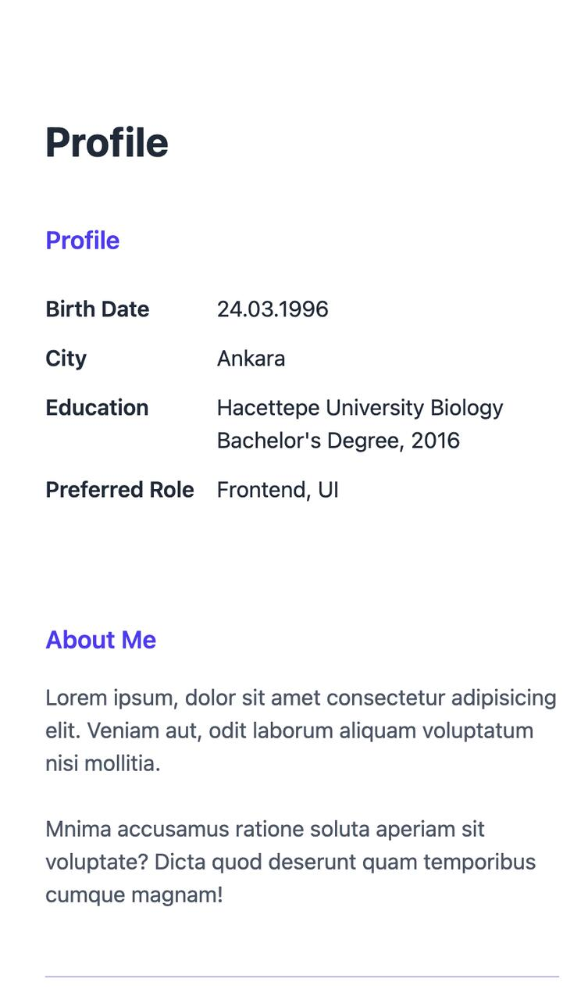
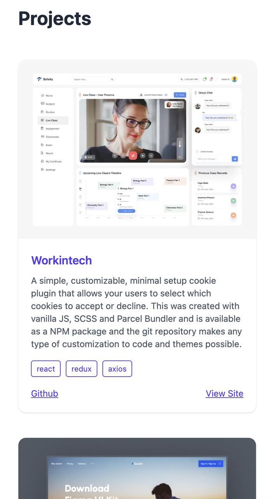

# 🌐 Personal Portfolio - Gozde Kocer

A pixel-perfect, responsive personal portfolio web application built with **React**, **Redux Toolkit**, and **Tailwind CSS**. Designed to showcase software development projects, technical background, and personal skills with multi-language and dark mode support.

## ✨ Features

- **Pixel-Perfect UI:** Built strictly following complex Figma designs with mobile-first responsiveness using Tailwind CSS.
- **Global State Management:** Integrated **Redux Toolkit** to handle cross-component states smoothly:
  - Multi-language toggling (English / Turkish).
  - Dynamic Dark Mode theme support.
- **Persistent Data:** User preferences (Language & Theme) are saved locally to provide a seamless user experience.
- **Interactive Feedback:** Real-time toast notifications powered by **React-Toastify**.
- **Automated Testing:** Verified key UI flows and component behavior using **Cypress**.

## 🛠️ Tech Stack

- **Frontend:** React.js, Vite
- **State Management:** Redux Toolkit, React Redux
- **Styling:** Tailwind CSS
- **Testing:** Cypress
- **Feedback:** React-Toastify
- **Deployment:** Vercel / Netlify

## 📸 Ekran Görüntüleri / Screenshots

  
  

  
  

  

## ⚙️ Getting Started

### Prerequisites

Make sure you have Node.js installed on your machine.

### Installation

1. Clone the repository:
   git clone [https://github.com/ggozdekocer/personal-portfolio.git](https://github.com/ggozdekocer/personal-portfolio.git)
   cd personal-portfolio

2. Install dependencies:
   npm install

3. Run the development server:
   npm run dev

4. Run Cypress E2E Tests:
   npm run cypress:open

## 👤 Author

- **Gözde Koçer** - [LinkedIn](https://linkedin.com/in/gozde-kocer) • [GitHub](https://github.com/ggozdekocer)
